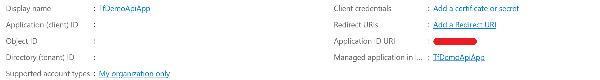

# Demo Content for Terraform for Developers: Deploying On-demand Azure Test Environments at Dec 2023 Microsoft Azure + AI Conference

## Setup

To deploy and run the application install:

1. Azure CLI: https://learn.microsoft.com/en-us/cli/azure/install-azure-cli-windows?tabs=azure-cli
1. Terraform: https://developer.hashicorp.com/terraform/install

To run the Terraform configuration, log into an Azure tenant and subscription in which you have appropriate permissions to manage resources. If not using default tenant or subscription additional options may be needed to log in.

```
az login --tenant <tenant ID>

az account set --subscription <subscription ID>
```

### Resources not included in demo Terraform configuration

The Entra ID tenant needs to have two app registrations with names matching the `api_app_registration_name` and `test_app_registration_name` variables defined in terraform/variables.tf (defaults used below are "TfDemoApiApp" and "IntegrationTestApp").

TfDemoApiApp needs to define an Application ID URI. If it doesn't have one a link to create will be shown in the App Registration overview page:



Under the `App roles` click `Create an app role` and fill in settings with Application selection for `Allowed member types` and check the enable box. The other fields can be any values you want. 

In the IntegrationTestApp API Permissions page, click `+ Add a permission`, then in the dialog under the `APIs my organization uses` tab select the TfDemoApiApp, and check the box for the permission you added.

Terraform will look up these registrations by name and pull in all the necessary IDs for you.

## Build Apps

The Demo.Processing.sln solution needs to be built using the Debug configuration to produce deployable applications. If making database changes, after changing the entity code, create a migration in the Demo.Processing.Data project with:

```
dotnet ef migrations add MyNewMigration
```

To update the DB script build using the DataScript solution configuration which will output a new dbSetup.sql file into the Terraform configuration.

Code changes may require restarting app services after deploying new code with `terraform apply`.